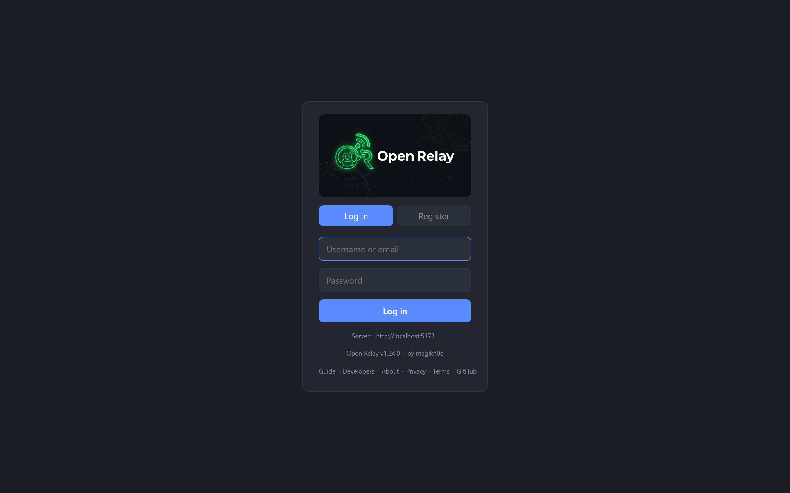
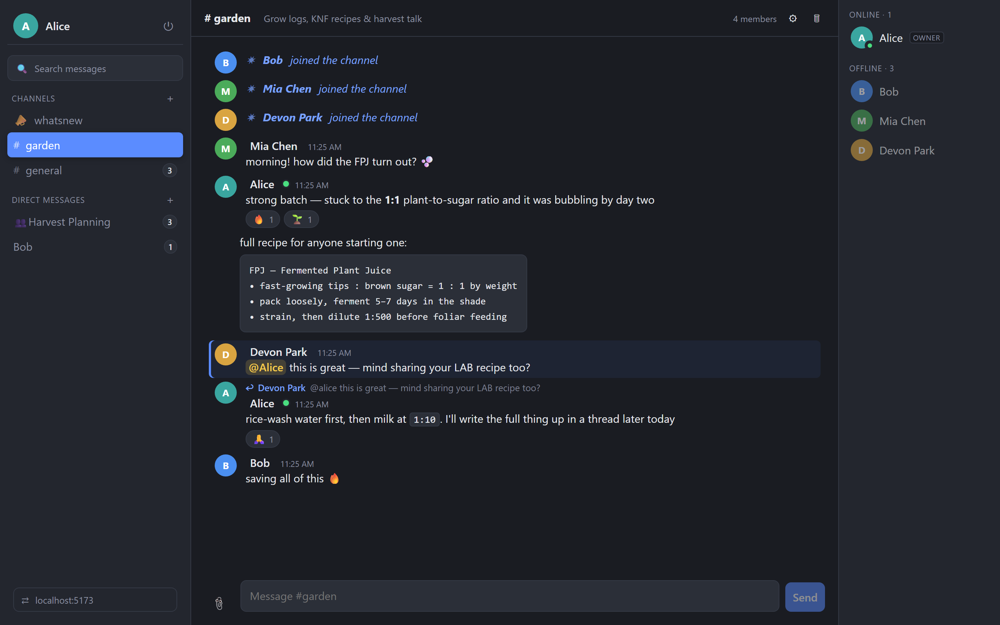
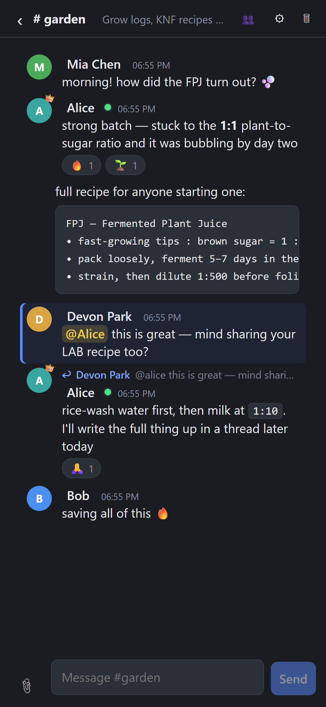

<p align="center">
  
</p>

<h1 align="center">Open Relay</h1>

<p align="center">
  A small, self-hosted chat service. Channels, threads and direct messages —
  with end-to-end encryption where it counts, and a plain account of what it
  does and doesn't protect.
</p>

<p align="center">
  <a href="https://openrelay.pl"><strong>▶ Try the live instance at openrelay.pl</strong></a>
</p>

<p align="center">
  <em>No ads. No analytics. No trackers. Free software under the GNU GPL-3.0.</em>
</p>

---

Open Relay is a chat server you run yourself. It's built for small groups —
friends, a team, a community — where the person running the server is someone
you know, rather than a company monetising your messages. It looks and feels
like a modern chat app, but the whole thing is a single Docker Compose stack
you own end to end.

## Screenshots

**A channel** — colour-coded avatars, formatting, code blocks, replies, mentions and reactions:



**An encrypted DM** — a lock badge, and a safety number both people can compare to rule out interception:


<p align="center">
  <br>
  <em>Installable as a home-screen app, with a proper mobile layout.</em>
</p>

## Features

**Chat**
- Public and private channels, and one-to-one direct messages you can close and reopen
- Threads, inline replies with a quoted preview, and @mentions
- Unread counts per channel, with a distinct badge when you're mentioned
- Emoji reactions, and GIF search (proxied, so your IP isn't handed to the GIF provider)
- File and image uploads — drag-and-drop, images compressed client-side
- Message formatting: **bold**, *italic*, ~~strikethrough~~, `inline code` and fenced code blocks
- Full-text search that jumps straight to the message, and infinite scroll-back
- Live presence, typing indicators and away status
- The IRC slash commands you'd expect (`/me`, `/nick`, `/join`, `/topic`, `/op`, …)

**Privacy & security**
- **End-to-end encrypted direct messages** — keys generated in your browser (ECDH P-256 + AES-256-GCM via the Web Crypto API), so the server stores ciphertext it can't read
- **Encrypted attachments** in encrypted DMs — the server never learns the file's contents, name or type
- **Safety numbers** to verify a conversation isn't being intercepted
- Photos are re-encoded in the browser before upload, stripping EXIF/GPS
- Privacy toggles (typing, presence, DMs, discoverability) that are **enforced server-side**, not just hidden
- Argon2 password hashing, token revocation on password change, and rate limiting on login, registration, messaging and uploads
- Self-service **data export** and **account deletion**
- Deleted messages and orphaned files are purged after a retention window

**Platform**
- Installable PWA (add to home screen / desktop); the app shell works offline
- Push notifications for DMs and mentions — payloads say *who* and *where*, never *what*
- Optional Discord (and Google) SSO alongside username/password
- A read-only `#whatsnew` announcements channel, seeded automatically

### What it deliberately does **not** protect

Being honest about this is the point:

- **Channel messages are readable by whoever runs the server** — only DMs can be end-to-end encrypted.
- Encryption hides message *contents*, not *metadata* — who talks to whom, and when, is recorded.
- Files shared in ordinary channels sit behind an unguessable but **publicly accessible** link.
- Forget your encryption passphrase and those messages are unrecoverable — there is no reset.

The full details are in the in-app [privacy policy](frontend/public/privacy.html).

## How it's built

```
Browser (React + Vite)
   │  HTTPS (REST)                WebSocket (one per session)
   ▼                             ▼
FastAPI workers  ── persist ──▶  PostgreSQL
   │  publish / subscribe
   ▼
 Redis  ◀── fan-out ──▶  every worker forwards to its own local sockets
```

- **Backend** — FastAPI, async SQLAlchemy 2.0 (asyncpg), Alembic migrations, PostgreSQL, Redis (pub/sub fan-out, presence leases, rate limiting). WebSockets for realtime; messages posted over REST.
- **Frontend** — React + Vite, no UI framework. The end-to-end crypto is vanilla Web Crypto with no dependencies.
- **Serving** — Caddy reverse proxy (automatic HTTPS) serves the built SPA and proxies `/api` and `/ws` to gunicorn/uvicorn.

## Run it locally

You need Docker, Python 3.13 and Node.

```bash
# 1. datastores
docker compose up -d            # Postgres + Redis

# 2. backend
cd backend
py -3.13 -m venv .venv && . .venv/Scripts/activate   # (Linux/macOS: source .venv/bin/activate)
pip install -r requirements.txt
cp .env.example .env            # dev defaults are fine
alembic upgrade head            # create the schema
uvicorn app.main:app --reload --port 8000

# 3. frontend (separate shell)
cd frontend
npm install
npm run dev                     # http://localhost:5173
```

The first backend start seeds the `#whatsnew` channel. Register a user in the
app and you're in.

## Deploy it

Production is a four-service Compose stack — Caddy + backend + Postgres + Redis
— in `docker-compose.prod.yml`. Caddy serves the built frontend and terminates
HTTPS automatically.

```bash
cp backend/.env.example .env.prod   # then edit: JWT_SECRET, PUBLIC_BASE_URL, SITE_ADDRESS, …
docker compose -f docker-compose.prod.yml --env-file .env.prod up -d --build
```

Migrations run automatically on backend start (`alembic upgrade head` in the
container entrypoint). Set `SITE_ADDRESS` to your domain and Caddy provisions a
certificate. See [`DEPLOY.md`](DEPLOY.md) for a full VPS walkthrough, including
the git push-to-deploy hook.

### Configuration

Everything is environment variables (`backend/.env.example` is the reference):

| Variable | Purpose |
|---|---|
| `DATABASE_URL`, `REDIS_URL` | Datastore connections |
| `JWT_SECRET` | **Change this** — signs auth tokens |
| `PUBLIC_BASE_URL` | Public origin, used to build OAuth redirects |
| `CORS_ORIGINS` | Allowed browser origins |
| `GOOGLE_*` / `DISCORD_*` | Optional SSO credentials |
| `GIPHY_API_KEY` | Optional; enables GIF search |
| VAPID keys | Auto-generated and stored in the DB on first boot — push works with no config |

## Using it

New here? The [**user guide**](docs/USER_GUIDE.md) covers encryption, formatting,
the slash commands, notifications, and managing your data.

## Desktop app

Native desktop builds — a thin [Tauri](https://tauri.app) shell around the same
web UI — are on the [**releases page**](https://github.com/magikh0e/open-relay/releases)
for macOS (universal), Linux (`.AppImage`/`.deb`/`.rpm`) and Windows
(`.msi`/`.exe`). They're ~4 MB and open the app in its own window pointed at a
server of your choice. Source is in [`desktop/`](desktop/README.md); building
your own needs only the Rust toolchain.

Client developers: the [**developer guide**](frontend/public/developers.html)
documents the full REST + WebSocket API, the E2EE wire format, and how to point
any client at a server.

## Tests

The backend has a pytest suite that runs against **real** Postgres and Redis
(the same containers dev uses), because the things worth testing — advisory
locks, cascade deletes, rate limiting, token revocation, encrypted-upload
opacity — only behave realistically against the real thing.

```bash
cd backend
pytest -q          # ~49 tests
```

## License

[GNU GPL-3.0](LICENSE). Free to use, modify and run yourself. These terms cover
the software; each running instance sets its own terms of use.

---

<sub>Screenshots are generated reproducibly by <code>frontend/capture-screenshots.mjs</code> (Playwright, dev-only — not a project dependency).</sub>
