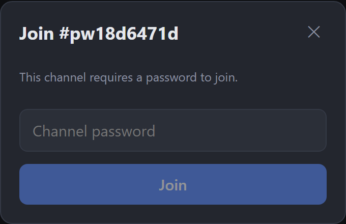
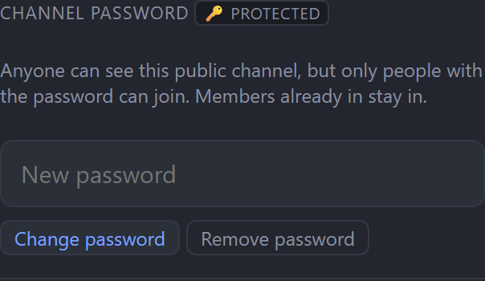
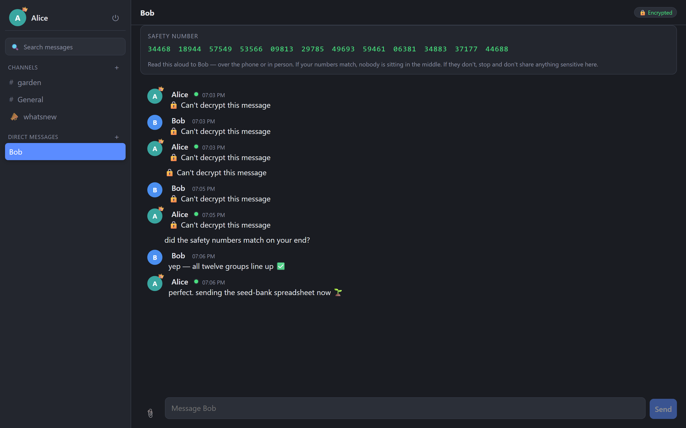

# Open Relay: user guide

Everything you need to get comfortable. If you just want to chat, the first two
sections are enough; the rest is here when you need it.

_Open Relay and this guide by **magikh0e**. Free software under the GNU GPL-3.0._

- [Signing in](#signing-in)
- [Channels and DMs](#channels-and-dms)
- [Writing messages](#writing-messages)
- [Formatting](#formatting)
- [Files and images](#files-and-images)
- [Search](#search)
- [Encrypted direct messages](#encrypted-direct-messages)
- [Notifications](#notifications)
- [Presence and privacy](#presence-and-privacy)
- [Your account and data](#your-account-and-data)
- [Channel webhooks](#channel-webhooks)
- [Install it as an app](#install-it-as-an-app)
- [Desktop app](#desktop-app)
- [Slash commands](#slash-commands)

---

## Signing in

Register with a username, email and password, or use **Continue with Discord**
if the server has it enabled. If the server is **invite-only**, the sign-up form
shows an extra **invite code** field; you'll need a code from an admin to
register. You land in `#whatsnew`, a read-only channel where release notes are
posted; you can react to those but not reply.

**Connecting to a different server.** The sign-in screen shows which server
you're on, with a link to change it. Open Relay is self-hosted, so you can point
the app (especially the desktop app) at any instance. Your login and encryption
keys are per-server, so switching is a fresh session.

## Channels and DMs

- **Channels** live in the left sidebar. Public ones anyone can open and join;
  private ones you have to be invited to.
- **Create a channel** with the `+` next to *Channels* (up to two if you're not
  an admin).
- **Direct messages** are one-to-one. Start one from the `+` next to *Direct
  Messages*, or from someone's profile.
- **Close a DM** by hovering it and clicking `✕`, or typing `/close`. It only
  hides it for you; nothing is deleted, and it comes back if either of you
  writes again.
- **Password-protected channels** show a 🔑. Anyone can see them in the
  directory, but you need the password to join; enter it when prompted, or use
  `/join #channel password`. A channel's owner sets, changes or removes the
  password under **Channel settings**; members already in stay in.





An **unread badge** shows on channels with new messages; if someone
**@mentions** you, the badge is highlighted so you can tell it apart from
ordinary traffic.

## Writing messages

- **Enter** sends. **Shift+Enter** starts a new line.
- **Reply** to a message from its hover menu; your reply shows the original
  quoted above it.
- **Start a thread** to branch a side conversation without cluttering the
  channel.
- **React** with emoji from the same hover menu.
- **@mention** someone by typing `@` and picking from the list.
- **Edit or delete** your own messages from their hover menu (on mobile, tap a
  message to reveal its actions).

Half-written messages are saved **per channel**; switch away and come back and
your draft is still there.

## Formatting

Type it inline as you write:

| You type | You get |
|---|---|
| `**bold**` | **bold** |
| `*italic*` | *italic* |
| `~~strike~~` | ~~strike~~ |
| `` `code` `` | `code` |

For multi-line code, fence it with triple backticks (use **Shift+Enter** for the
line breaks):

    ```
    def hello():
        return "world"
    ```

Anything inside backticks stays literal, so pasted code with `*asterisks*` or
`@names` won't be turned into formatting or mentions.

## Files and images

Drag a file anywhere onto the conversation, or use the 📎 button. Images preview
inline; other files arrive as a download card.

**Photos are re-encoded in your browser before upload**, which shrinks them and
strips embedded location (EXIF/GPS) data; the original with your coordinates
never leaves your device.

> Files shared in an ordinary channel sit behind an unguessable but
> **public** link: anyone given that link can open it. Files in an *encrypted*
> DM are encrypted too (see below).

## Search

Search from the box at the top of the sidebar. Results **jump straight to the
message** and highlight it in its channel, so you see it in context.

Encrypted DMs are excluded from search; the server can't read them to index
them.

## Encrypted direct messages

Direct messages can be **end-to-end encrypted**: your browser holds a private
key the server never sees, so it stores scrambled text it has no way to read.



**Turning it on**

1. Open a DM and use the prompt to **set up encryption**.
2. Choose a passphrase. This protects your key; you'll enter it on each new
   device.
3. Both people need encryption enabled. When it's active, a **🔒 Encrypted**
   badge appears at the top of the conversation.

**Verify it's really private.** Click the 🔒 badge to reveal a **safety
number**. Read it aloud to the other person, in a call or in person. If your
numbers match, nobody is intercepting the conversation. This is worth doing once
per contact.

**Important:**

- If you **forget your passphrase**, those messages are gone for everyone,
  permanently. There is no reset; not even the server admin can recover them,
  because the key they store is locked with your passphrase.
- Encryption hides *what* you said, not *that* you said it: the server still
  records who you message and when.
- Files you send in an encrypted DM are encrypted too; the server never learns
  their contents, name or type.

## Notifications

Open your profile → **Privacy** → *Notify me on this device* to get browser
notifications for DMs and mentions, even with the app closed.

Notifications tell you **who** messaged you and **where**, never the message
text. That keeps message contents off the notification and out of the push
service entirely.

## Presence and privacy

Open your profile → **Privacy**. Each toggle is enforced by the server, so
turning one off actually stops the signal; it isn't just hidden on your screen:

- **Show when I'm typing**: the "is typing…" indicator.
- **Show when I'm online**: turn off to always appear offline.
- **Allow new direct messages**: existing conversations keep working.
- **Let people find me in search**: you stay visible in channels you're in.
- **Show when I was last active**: turn off to hide your last-active time from
  others. You and admins still see it, and the server still records it; the
  switch only controls who it's shown to.

Profiles also note **how someone joined** (an invite, naming who invited them,
or open sign-up) and, unless hidden, **when they were last active**.

## Your account and data

From your profile:

- **Change password**: you'll confirm the current one. Changing it **signs out
  every other device**, which is what to do if you think someone else has
  access.
- **Your data → Download my data**: everything the server holds about you, as a
  JSON file. Encrypted messages come out as the scrambled text the server
  stores.
- **Your data → Delete my account**: permanent and immediate. Your account,
  keys and settings are erased; messages you sent stay in other people's
  conversations but stop being attributed to you.

## Channel webhooks

Incoming webhooks let outside services post into a channel: CI results, alerts,
home-automation events, anything that can send an HTTP request.

If you **own or moderate** a channel, open **Channel settings → Webhooks** to
create one. You get back a **secret URL**; anything POSTed to it appears in the
channel under a name you choose. Copy the URL when you create it, and **revoke**
it from the same place anytime it leaks or you're done with it.

> Treat the URL like a password: anyone who has it can post to the channel. The
> request format is in the [developer guide](DEVELOPER_GUIDE.md).

## Install it as an app

Open Relay can be installed like a native app and opens in its own window:

- **Android / desktop Chrome**: use the **Install** option in the address bar or
  menu.
- **iPhone / iPad**: **Share → Add to Home Screen**.

The app shell loads offline, though you still need a connection to send or
receive messages.

## Desktop app

There's also a native desktop app for **macOS, Linux and Windows**: the same
Open Relay in its own window, built with Tauri and Rust, around 4 MB. Download it
from the [releases page](https://github.com/magikh0e/open-relay/releases).

It points at your server just like the web app, and **updates itself**: when a
new version is published it asks whether to install, then updates and restarts on
your OK. You're never forced, and it only checks GitHub for the new build; it
never phones home about you.

## Slash commands

Type these in the message box. `/help` lists them in-app.

| Command | What it does |
|---|---|
| `/me <action>` | Post an action ("* Alice waves") |
| `/nick <name>` | Change your display name |
| `/join <#channel>` | Join and open a public channel |
| `/part` · `/close` | Leave a channel, or close a DM |
| `/query <user>` · `/dm <user>` | Open a DM |
| `/invite <user>` | Add someone to the current channel |
| `/whois <user>` | Open a user's profile |
| `/names` | List who's in the channel |
| `/topic <text>` | Set the channel topic |
| `/away [message]` · `/back` | Set or clear your away status |
| `/ignore <user>` | Hide a user's messages (local to you) |
| `/op <user>` · `/deop <user>` | Grant or remove operator status |
| `/kick <user>` · `/ban <user>` · `/unban <user>` | Moderation |
| `/mode +o` · `+b` · `+k <key>` · `+i` | IRC-style: op, ban, set channel key, invite-only (use `-` to reverse) |
| `/shrug` · `/slap <user>` | The classics |
| `/version` | Show the app version |

Coming from IRC? A few aliases work too: `/j` for `/join`, `/leave` for
`/part`, `/msg` for `/query`, and the `/mode` flags above map onto `/op`,
`/ban`, the channel password, and the private toggle.

Moderation commands require you to be a channel operator or admin.
